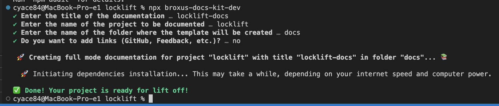
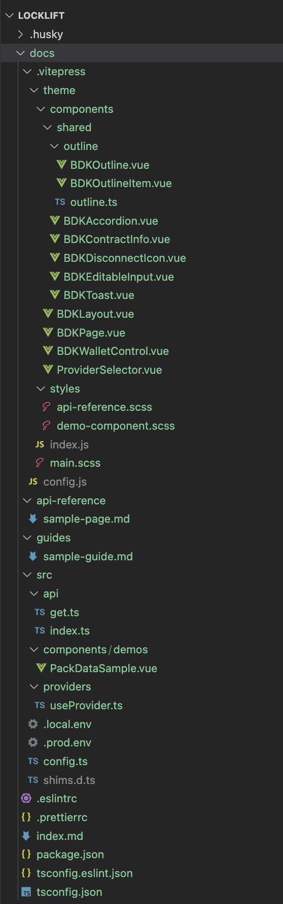

# Install

## Prerequisites

Before you get started, please ensure that you have Node.js installed on your machine. In order to guarantee the successful execution of this package, it's highly recommended to use Node.js version 16.14.0 || >=18.0.0. You can check your Node.js version by running `node -v` in your terminal.

If you need to install or update Node.js, visit the [official website](https://nodejs.org/) for download instructions. If you need to manage multiple versions of Node.js on your machine, consider using a version manager like [nvm](https://github.com/nvm-sh/nvm) or [n](https://github.com/tj/n).

With the right version of Node.js, you can install and use this package with confidence. Please follow the instructions below to install and run the broxus-docs-kit-dev package.

```bash
npm install --save-dev broxus-docs-kit-dev
```

## Usage

```bash
npx broxus-docs-kit-dev
```



## Template



This is a brief documentation for a template based on Vitepress. The template is organized into various folders and files, each with its specific functionality.

## Folder Structure

- `docs/.vitepress` - This directory holds all Vitepress specific configurations and theme related files.
- `docs/.vitepress/theme` - Contains everything related to the theme, including Vue components and styles.
- `docs/.vitepress/theme/components` - Here, all Vue components related to the theme are stored.
- `docs/.vitepress/theme/styles` - This directory houses all the global styles.
- `docs/.vitepress/config.js` - The main configuration file for the Vitepress documentation.
- `docs/src/` - A directory for user-specific files, potentially including custom components and styles.

All components and global styles are registered in the `docs/.vitepress/theme/index.js` file.

## Vitepress Configuration (`config.js`)

The `config.js` file holds the main configuration settings for the Vitepress documentation. Here, you can define the title, base URL, description, and various other options for your documentation.

### Adding Pages to the Sidebar

The `sidebar` property in `themeConfig` is used to define the structure and contents of the sidebar. Each item in the `sidebar` array corresponds to a sidebar link. The `text` and `link` properties of each item define the label and the path of the sidebar link respectively.

For instance, to add a new page to the sidebar:

```javascript
sidebar: [
  {
    text: 'New Page',
    link: '/new-page.md',
  },
],
```

This will create a new sidebar link labeled "New Page" that links to "new-page.md".

### Navigation Bar

The `nav` property in `themeConfig` is used to define the structure and contents of the navigation bar. Each item in the `nav` array corresponds to a navigation link.

## Guides and API References

The `docs/guides` and `docs/api-reference` folders contain markdown files that serve as examples and mini-guides on how to create documentation pages and auto-generate API references.

## Building and Running the Template

To build or run the template, navigate to the `docs` directory and use the following commands:

- `yarn build`: This command builds a static version of the documentation and outputs it to the `.vitepress/dist` directory.
- `yarn dev`: This command starts the development server.

Please ensure you have `yarn` installed on your machine before running these commands.
